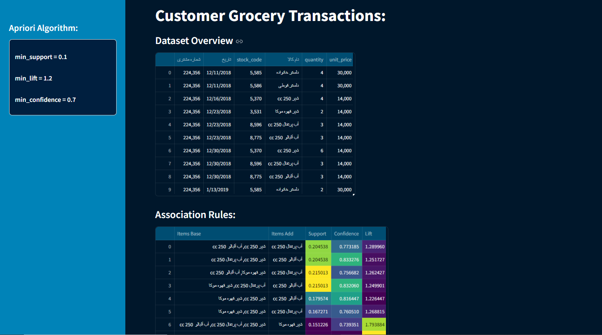

# Creating the README.md file with the provided markdown content.

readme_content = """


# FMCG Recommendation System using Apriori Algorithm

This project is a recommendation system for Fast-Moving Consumer Goods (FMCG), built using the Apriori algorithm. It analyzes transaction data to identify frequent item sets and generate recommendations for products that are often purchased together. The system is designed to provide insights for inventory management, cross-selling, and enhancing customer experience.

## Features

- **Frequent Itemset Mining**: Identifies frequent product combinations in transaction data.
- **Association Rules**: Generates rules to suggest related items based on historical purchase data.
- **Support, Confidence, and Lift Metrics**: Evaluates the strength of associations to prioritize recommendations.
- **Scalability**: Capable of handling large datasets typical in FMCG environments.

## Installation

1. **Clone the repository**:
   ```bash
   git clone https://github.com/parvanerezaeepm/Apriori.git


